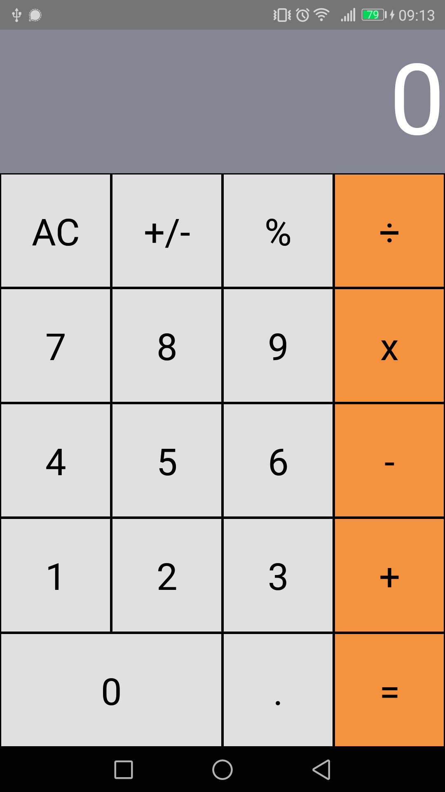

# 1. aplikacja startowa: kalkulator
## Cel
- poniższe zagadnienia powinny zostać zrealizowane:
    - dla wybranej technologii: instalacja pakietów i tworzenie projektu, ustawienia projektu, korzystanie z serwera deweloperskiego,
    - wykorzystanie podstawowych komponentów i API dla wybranej technologii, np. dla React Native,
    - zapoznanie z komponentami dla wybranej technologii i ich użycie, np. dla React Native,
- w każdym z zadań można użyć Expo lub React Native CLI lub create-react-native-app,

## Efekt pracy
Poniżej widoczny jest widok aplikacji mobilnej RNCalculator.
\
Aplikację tworzyłem za pomocą **React Native CLI**.
Jest ona portem na urządzenia mobilne kalkulatora z przykładowych projektów Reacta (https://ahfarmer.github.io/calculator/). 

Składa się ona z 4 głównych komponentów:
 - App,
 - Display,
 - ButtonPanel,
 - Button.

### App
Jest to komponent klasowy zawierający stan odpowiadający za aktualny stan kalkulatora.

#### State
total - aktualna suma
next - liczba na której zostanie wykonana operacja (wraz z total)
operation - znak symbolizujący operację do wykonania (+, -, * itd)

#### Render
App jest komponentem nadrzędnym dla Display oraz ButtonPanel.
Do display zostaje przekazana odpowiednia wartość do wyświetlenia: next, total, albo 0 w przypadku gdyby dwie poprzednie nie miały żadnej wartości.
Do ButtonPanel zostaje przekazana funkcja obsługująca przyciśnięcie przycisku handlePress.

#### handlePress
Funkcja obsługująca przyciśnięcie klawiatury kalkulatora. Oczekuje ona nazwy wciśniętego przycisku i na jego podstawie zostaje utworzony nowy stan kalkulatora za pomocą funkcji calculate odpowiadającej za całą logikę.

### Display
Jest to komponent funkcyjny, bezstanowy, odpowiedzialny za wyświetlacz kalkulatora.

#### Props
We właściwościach zostaje mu przekazana wartość (props.value) do wyświetlenia na ekranie.

#### Return
Display jest komponentem nadrzędnym dla komponentów RN - View oraz Text.
View jest kontenerem zajmującym 1/5 ekranu. Wewnątrz niego znajduje się Text, który wypisuje wartość przekazaną we właściwościach (props.value).

### ButtonPanel
Jest to komponent funkcyjny, bezstanowy, odpowiedzialny za panel przycisków kalkulatora.

#### Props
We właściwiościach zostaje mu przekazana funkcja obsługująca wciśnięcie klawisza klawiatury kalkulatora.

#### Return
ButtonPanel zwraca View zajmujące pozostałe 4/5 ekranu. Jego obszar został następnie podzielony na 5 części. Każdą 1/5 zajmuje kolejny komponent View odpowiedzialny za dany wiersz przycisków. W każdym wierszu znajduje się kilka komponentów Button. Do każdego z nich zostaje przekazana jego nazwa, funkcja obsługująca przyśnięcie, oraz dwie opcjonalne flagi: orange i wide.

### Button
Jest to komponent funkcyjny, bezstanowy, odpowiedzialny za pojedynczy przycisk kalkulatora.

#### Return
Zwraca on komponent RN TouchableOpacity wewnątrz którego znajduje się RN Text. TouchableOpacity pozwala na tworzenie niestandardowych przycisków. Podstawowy komponent RN Button ma bardzo ograniczone możliwości jeżeli chodzi o jego stylizowanie. Dzięki wykorzystanemu komponentowi mogłem stworzyć przyciski dostosowane do moich potrzeb. Został mu przekazany parametr onPress z funkcją otrzymaną w propsach. Komponent Text wypisuje napis klawisza przekazany we właściwościach.

### Logika
Logika została zaczerpnięta z pierwowzoru kalkulatora. W niżej wymienionych funkcjach wykorzystywana jest biblioteka **Big.js** (https://mikemcl.github.io/big.js/). Służy ona do działań arytmetycznych wysokiej precyzji.

#### calculate.js
Funkcja aktualizująca stan kalkulatora na podstawie przyciśniętego przycisku jego klawiatury.

#### isNumber.js
Funkcja pomocnicza która testuje czy przekazana wartość pasuje do kryterium określonego przez wyrażenie regularne, a w tym przypadku czy jest ona numerem.

#### operate.js
Funkcja pomocnicza obsługująca podstawowe operacje arytmetyczne: +, -, /, *.
