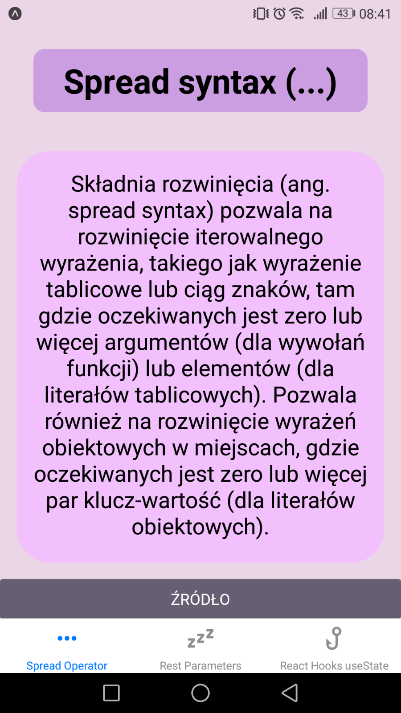
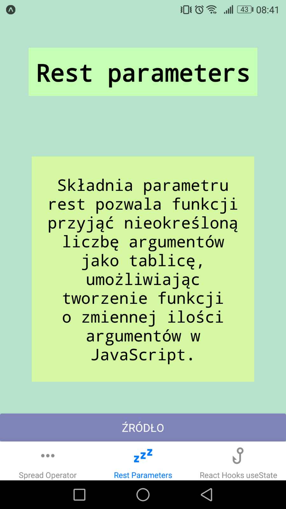
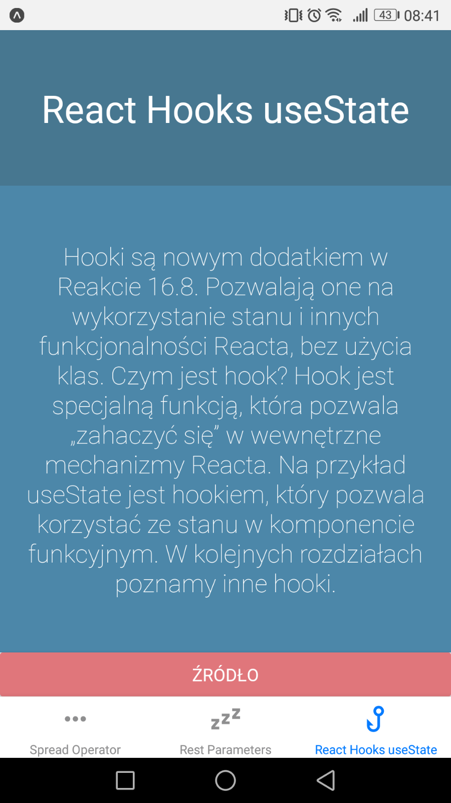

# 2. responsywne layouty + nawigacja

## Cel

- poniższe zagadnienia powinny zostać zrealizowane:
  - należy utworzyć 3 ekrany za pomocą react-navigation,
  - do przechodzenia między ekranami można użyć stack-navigator,
  - na każdym ekranie powinny się znaleźć przyciski pozwalające przejść do dwóch pozostałych ekranów,
  - każdy ekran powinien byc "ostylowany" w innym stylu niż pozostałe ekrany, z wykorzystaniem Flexboxa (m. in. poprzez moduły StyleSheet i Platform),
  - style należy utworzyć w pliku styles.js i zaimportować w odpowiednim miejscu,
  - należy umieścić na ww. ekranach informacje, czym jest spread operator, czym są rest parameters oraz do czego służy 'hook' useState

## Efekt pracy

Aplikacja składa się z trzech ekranów:

- [Spread Operator](RNRespLayout/components/SpreadOperScreen.js)
- [Rest Parameters](RNRespLayout/components/RestParamsScreen.js)
- [React Hooks useState](RNRespLayout/components/ReactHooksScreen.js)

Wszystkie ekrany są do siebie bardzo podobne. Składają się z trzech głównych elementów: tytułu, tekstu i przycisku.

Tytuł i tekst to komponenty Text umieszczone wewnątrz komponentu View, tak żebym można było je dogodnie rozmieścić z wykorzystaniem flexboxa.

Przycisk jest standardowym komponentem Button. Jako parametr onPress została mu przekazana metoda [Linking.openURL()](https://reactnative.dev/docs/linking#openurl), dzięki czemu po przyciśnięciu na przycisk zostanie otworzona strona w przeglądarce o adresie podanym jako parametr metody.

Style wszystkich ekranów zostały umieszczone w pliku [styles.js](RNRespLayout/assets/styles/styles.js).

Do przechodzenia między ekranami wykorzystałem [createBottomTabNavigator](https://reactnavigation.org/docs/bottom-tab-navigator/) od React Navigation. 
Navigator'owi wskazałem, aby najpierw wyświetlał stronę Spread Operator.
Wewnątrz nawigatora umieściłem trzy komponenty screen, po jednym dla każdej strony. W parametrach przekazałem odpowiadające im komponenty oraz w opcjach wskazałem jakie ikony mają być wyświetlane na pasku. Do ikon użyłem ["react-native-vector-icons/MaterialCommunityIcons"](https://oblador.github.io/react-native-vector-icons/).

### [Spread Operator](RNRespLayout/components/SpreadOperScreen.js)

### [Rest Parameters](RNRespLayout/components/RestParamsScreen.js)

### [React Hooks useState](RNRespLayout/components/ReactHooksScreen.js)

